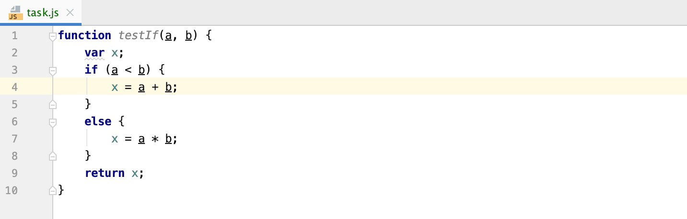
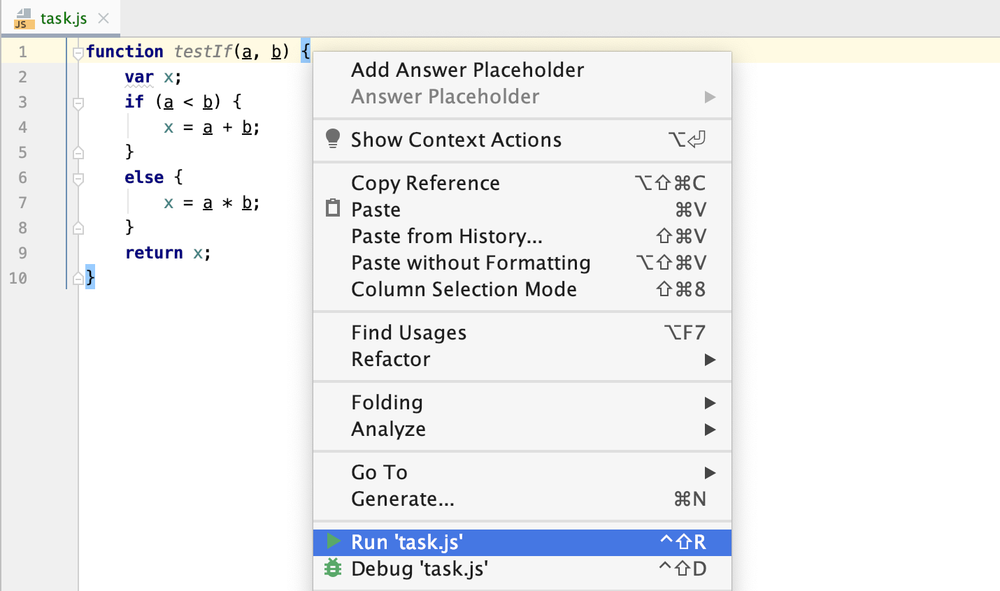

## Editor

The **Editor** is your playground and where you will mainly be programming. You can experiment here as you work on theory tasks and quizzes, without being checked.

For programming assignments, the Editor is where you’ll find the code you need to fix or write your own code from scratch. This code will be checked.

To run your code at any time, choose **Run** option from the context menu or press &shortcut:Run;:

 
If you want to go back to the Editor and focus on your code, the fastest way to do it is with the Hide All Windows command (&shortcut:HideAllWindows;). To get all the windows back, use the command one more time. 
