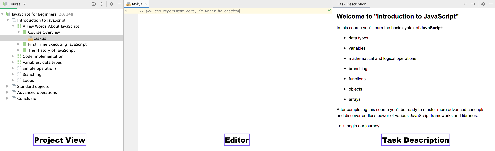

# EduTools plugin overview

This tutorial is designed to help you take your first steps with the [EduTools plugin](https://www.jetbrains.com/help/education/educational-products.html) and use it to learn programming.

With the EduTools plugin, you can learn programming languages and tools by completing coding tasks, and get instant feedback right inside the IDE.

Enough talking – let's get started!

## Working with courses
  
  Every course available in EduTools is structured as a list of lessons. Lessons, in turn, can be grouped or divided into sections. Each lesson contains tasks.
  
  When you open your course, you will see the main tool windows used for navigation: 
  **Project View**, **Editor**, and **Task Description**:
  
  
  
Click  to switch to the next task.

