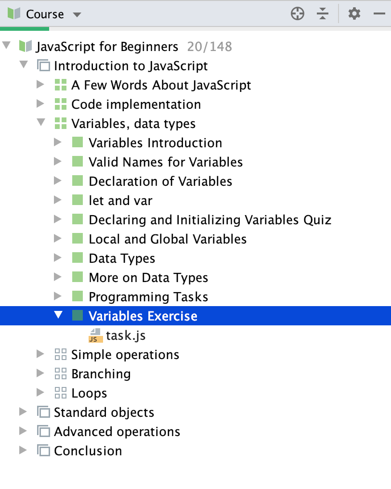

## Project view
**Project View** shows the course syllabus – a list of lessons with lesson steps, or tasks:

You can navigate to a task by clicking its name.

To hide the Project View window, click the Project Tool Window button or press &shortcut:ActivateProjectToolWindow;. This will give you more space for code and the task description. Click the Project Tool Window button (or press &shortcut:ActivateProjectToolWindow;) once again to show the hidden Project View.
