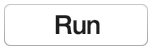
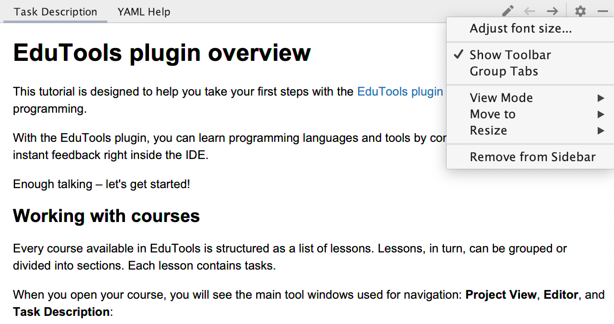

## Task Description

The **Task Description** window gives you all the information you need to complete a task:

For theory tasks, the description provides learning and reading materials.
For quizzes, it states the question and the possible answer options.
For programming assignments, it states the problem to be solved.

Use the Task Description icons for the following actions:

 – check the correctness of your answer (for a quiz) or your code solution (for a programming task). 
 – run your code (for a theory tasks). 

 – go to the previous task.    

 – go to the next task.  

 – discard all the changes you’ve made in the task, and start over.  
 
 – view the task page on Stepik and leave a comment.  

 
– reveal the correct answer and show the <b>diff</b>.

We recommend keeping the Task Description visible and not hiding it completely. But if it proves too distracting, you can move it out of the way by clicking the  button in the top right-hand corner of the Task Description window.

If you work with two monitors, it may be helpful to switch the Task Description panel to floating mode and move it to the second monitor, or just place it near the main IDE window. To do this, click the tool window settings  icon : 

